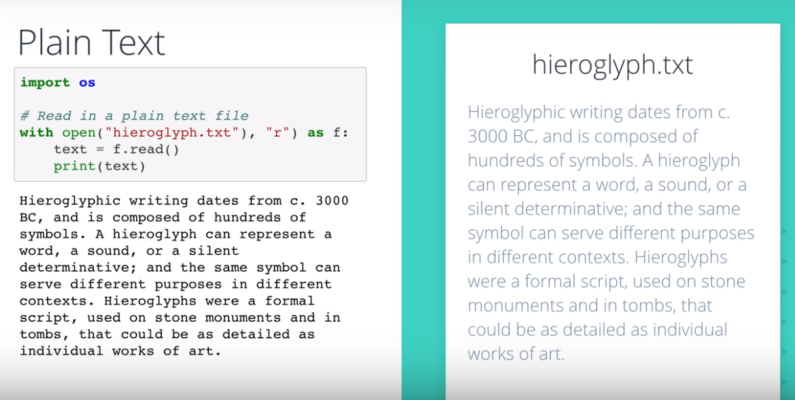
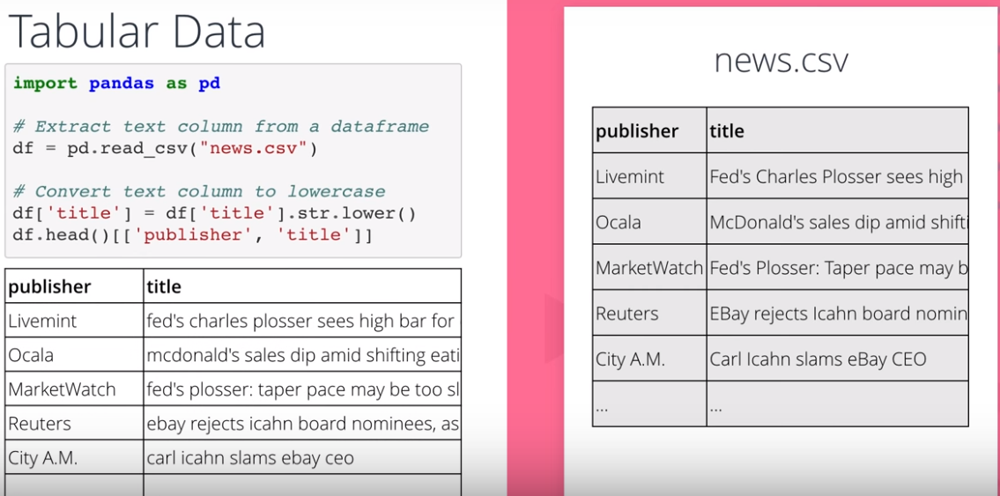
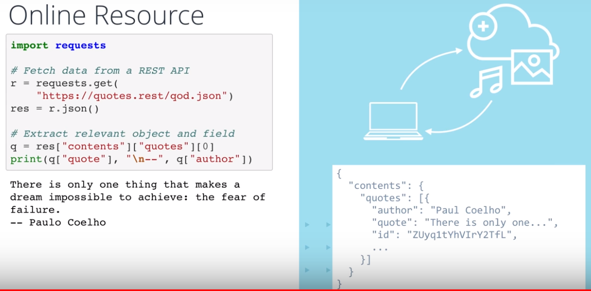
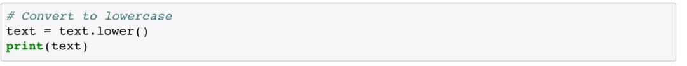
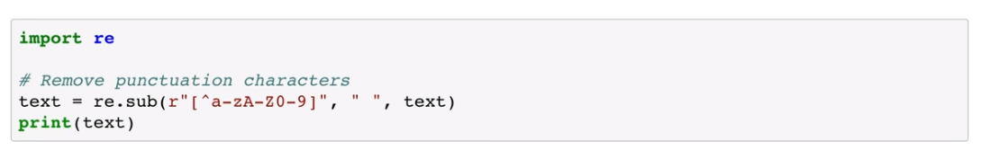

# Text Processing

## Acquire Text Data  

[Pandas: Working with Text data](https://pandas.pydata.org/pandas-docs/stable/user_guide/text.html)

## Normalization
### Case normalization

### Punctuation removal

# Regex